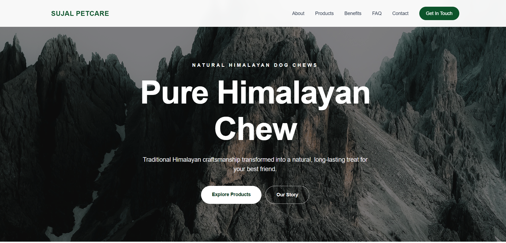

# Sujal Petcare Website

This project is a frontend recreation of the Sujal Petcare website, developed as part of a Frontend Developer Intern technical task.

The main goal was to recreate the website using React and Tailwind CSS while keeping the layout responsive and the components reusable.

## Live Website

https://sujal-petcare-one.vercel.app/

## GitHub Repository

https://github.com/paudel-a/Sujal-petcare

## Tech Used

- React.js
- JavaScript (ES6+)
- Tailwind CSS
- Vite
- Lucide React
- Git & GitHub

## Features

- Responsive navbar
- Mobile navigation menu
- Hero section
- About section
- Why Churpi section
- Benefits section
- Product section
- FAQ accordion
- Contact form with basic validation
- Responsive design for mobile, tablet and desktop
- Hover effects and transitions

## Project Structure

The project is divided into reusable components such as:

- Navbar
- Hero
- About
- WhyChurpi
- Benefits
- FeatureCard
- Products
- ProductCard
- FAQ
- Contact
- Footer

Product, feature and FAQ information is kept separately in the `data` folder and passed to reusable components through props.

## Challenges

The main challenges were recreating the layout of the reference website while keeping the components reusable and responsive across different screen sizes.

I also implemented the mobile navigation menu, FAQ accordion and contact form validation using React state.

## Running the Project

Clone the repository:

```bash
git clone https://github.com/paudel-a/Sujal-petcare.git

## Screenshots

### Desktop



### Products and FAQ


### Mobile


